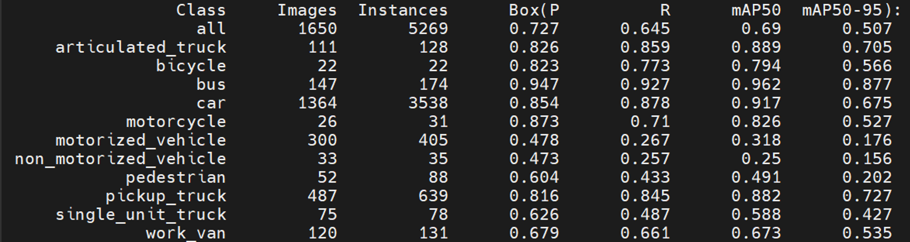
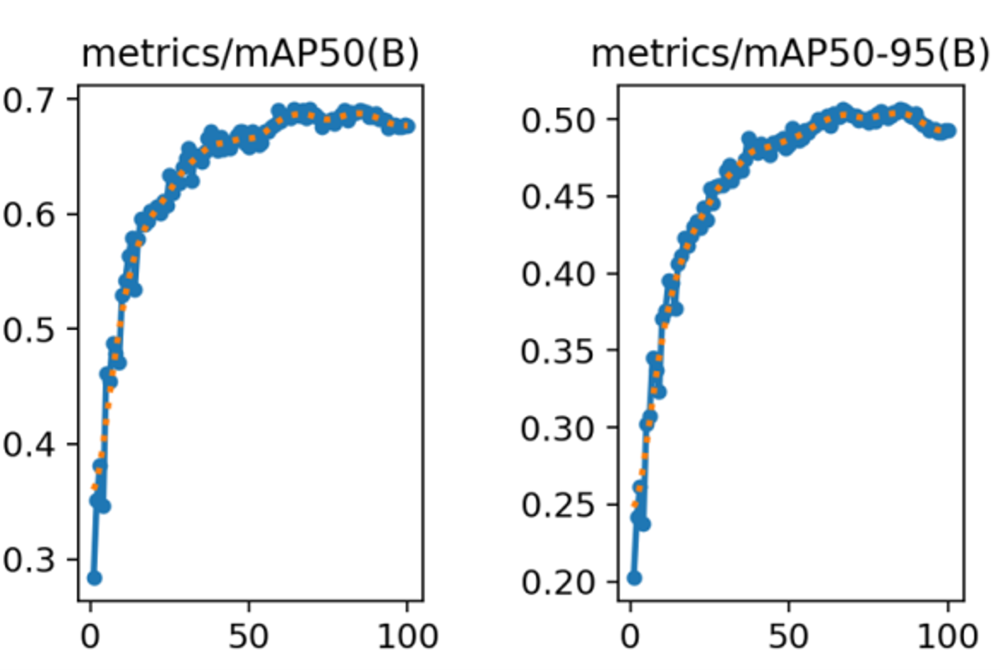
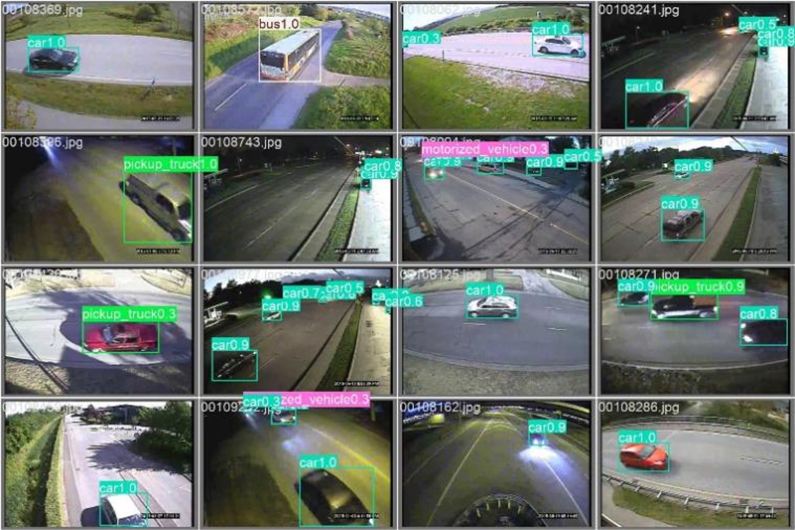

# XD-Prune: Traffic YOLO
<YOLO on PYNQ for Smart Traffic Systems.>

This project focuses on cross-domain pruning for edge devices.

This repo is a research for developing, analyzing, optimizing, and deploying YOLO-based traffic detection models on edge devices.

Using the MIO-TCD traffic dataset and PYNQ-Z2 board, provides workflows for model training, profiling, error-injection analysis, structured pruning techniques, NCNN conversion, and performance benchmarking across pc/server and embedded platforms.

Serves as an experiment for researchers and people interested in edge AI, model compression, hardware-aware optimization, and intelligent transportation systems.

## Repo main folders

| Folder | Files | Types (main) |
| --- | --- | --- |
| 1_data/ | dataset and related info | .png .mov .csv .yaml |
| 2_scripts/ | scripts for pc or server uses | .py .sh |
| 2_scripts_pynq/ | scripts for pynq board uses | .cpp .sh |
| 3_models/ | pt and ncnn models | .pt .param .bin .yaml |
| (4 to 8)\_results_*/ | experiment results | .csv .pt |

## .md files

1. **[Model Training](1_tarin.md)** — Convert MIO-TCD dataset to YOLO format and train baseline YOLO26n models.
2. **[Profiling](2_profiling.md)** — Layer-wise and end-to-end latency profiling of GEN and SNOW baselines.
3. **[Error Injection](3_error_injection.md)** — Gaussian activation error injection experiments for robustness analysis.
4. **[(Limited) Global L1 Pruning](4_custom_global_L1.md)** — Incremental target search, replay, recovery, and GEN P56 pipeline.
5. **[Layer Replacement Pruning](5_layer_replacement.md)** — Baseline validation, dual-domain sweeps, near-target combinations, and efficiency-greedy runs.
6. **[PT → NCNN Export](6_pt_to_ncnn.md)** — Export checkpoints to NCNN in FP32/FP16/INT8 formats at multiple resolutions.
7. **[Size, Speed & Accuracy](7_size_speed_accuracy.md)** — Measure NCNN model size, runtime speed, and accuracy on server and PYNQ.
8. **[PC ↔ PYNQ Live Video](8_pc_pynq_video.md)** — Run live video inference via TCP between PC client and PYNQ NCNN server.

## Validate

Validation is frequently performed to assess model accuracy after certain actions (such as training, error injection, pruning, etc.). There are some points that people may pay attention to:

 
Figure 1: Per-class accuracy.

The overall accuracy may be high, but it can be unbalanced among classes (depending on the training dataset).

 
Figure 2: Eopch accuracy.

A high epoch does not guarantee high accuracy; it is important to use the best model instead of the last model.

 
Figure 3: Image with boxes.

Figure 3 shows an example of object detection results from a YOLO model.

## Summary

1\. **training** to produce baseline models.  
2, 3. **profiling** and **error injection** for performance and robustness testing.  
4, 5. **Global L1** and **Layer Replacement** for pruning.  
6\. Export models to **NCNN** for deployment.  
7\. Evaluate **size, speed, and accuracy** on server or PYNQ board.  
8\. **live video streaming** from PC to PYNQ.

---
For detailed instructions, please read each corresponding `.md` file listed above.  
