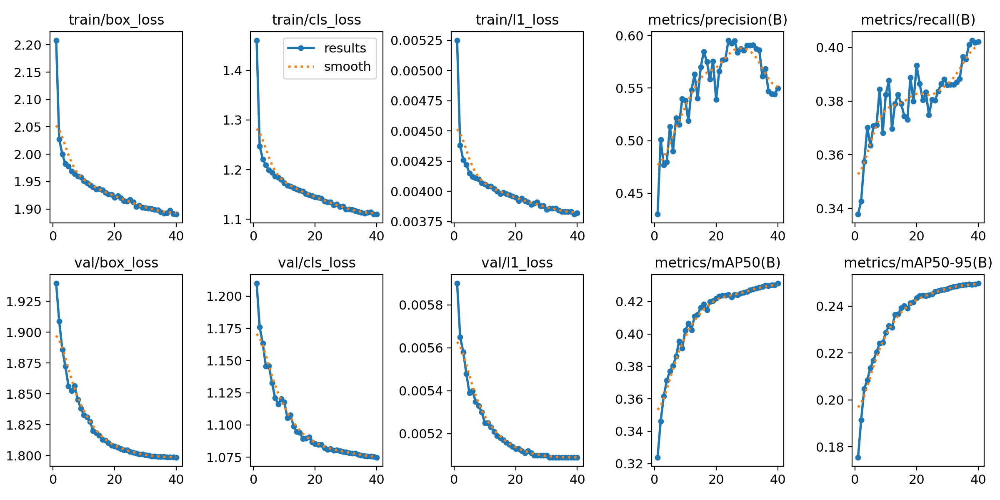
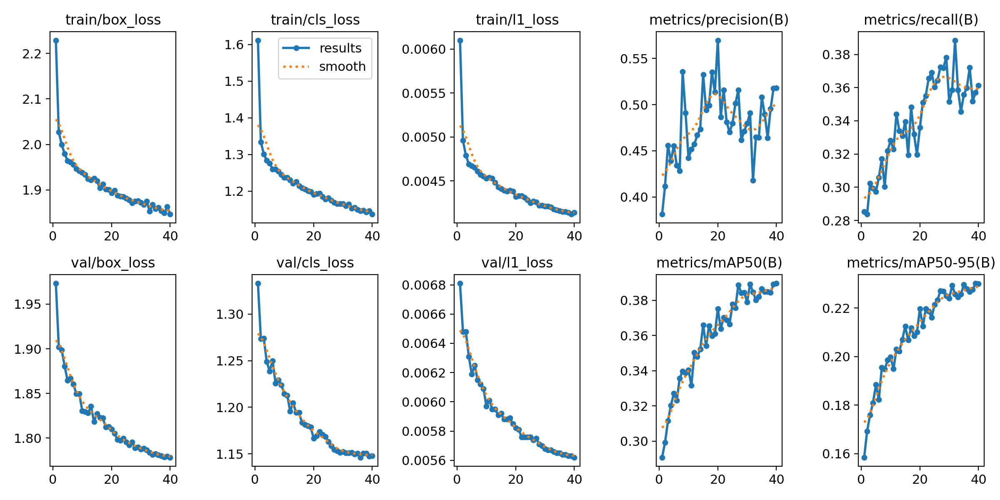
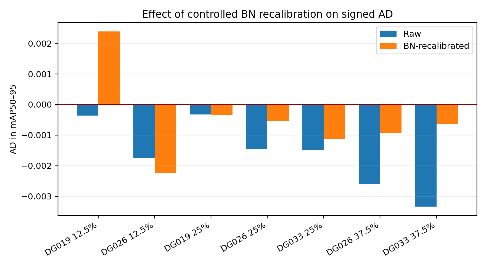
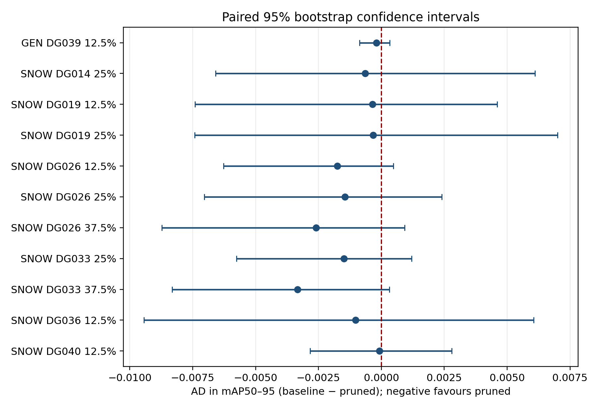

# YOLO26n XD-Prune

This repository is the self-contained XD-Prune contribution to TrafficYOLO.
It contains source code, frozen experiment definitions, compact ranking and
recovery evidence, aggregate results, deployment utilities, and the 17 final
paper model packages. Datasets, intermediate checkpoints, optimizer state,
raw logs, and models outside the reported study are intentionally absent.

## Start here

- [`docs/DATA.md`](docs/DATA.md): datasets and expected layouts
- [`docs/METHOD.md`](docs/METHOD.md): dependency groups and ranking equations
- [`docs/REPRODUCIBILITY.md`](docs/REPRODUCIBILITY.md): ordered experiment workflow
- [`docs/RESULTS.md`](docs/RESULTS.md): supported findings and limitations
- [`docs/DEPLOYMENT.md`](docs/DEPLOYMENT.md): NCNN/PYNQ-Z2 PS-side workflow
- [`models/README.md`](models/README.md): final PyTorch and NCNN paper artifacts

The primary machine-readable BDD100K comparison is
[`results/tables/bdd100k_t7_matched_results.csv`](results/tables/bdd100k_t7_matched_results.csv).

## Selected visual evidence

The selected output figures below complement the machine-readable result
tables; they are not substitutes for the corresponding manifests, CSVs, or
validation protocol. See [`figures/README.md`](figures/README.md) for their
provenance and interpretation.

  
  

  
  

Install a compatible PyTorch/torchvision build for the target system first,
then install the remaining dependencies with
`pip install -r requirements.txt`.

## Directory guide

| Directory | Purpose |
|---|---|
| `configs/` | Frozen baseline, evaluation, and pruning settings |
| `data_views/` | Dataset YAML descriptors; no images or labels |
| `deployment/` | PC export and PYNQ-Z2 ARM/NCNN benchmark scripts |
| `experiments/` | Staged-recovery engines and final paper-run evidence |
| `models/` | Hash-verified final PyTorch and NCNN paper artifacts |
| `results/depgraph/` | Physically validated dependency-group catalogues |
| `results/pruning/` | Compact T1/T2 and ranking evidence |
| `results/tables/` | Aggregate, manuscript-facing CSV tables |
| `scripts/` | Dataset, pruning, recovery, evaluation, and comparator code |

Run commands from the repository root so that the relative paths above resolve
consistently.
