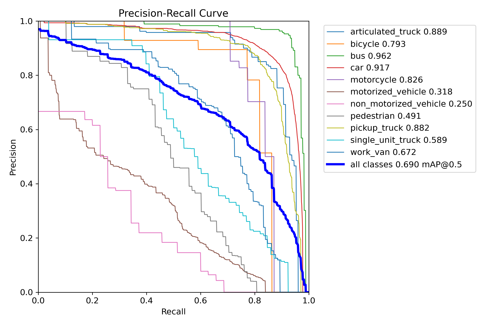
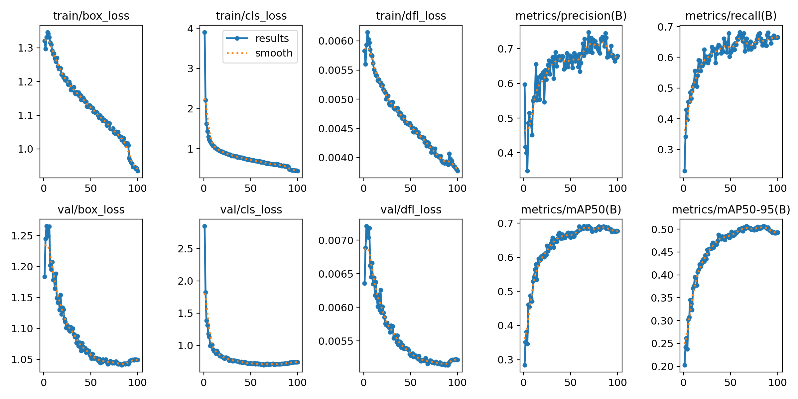
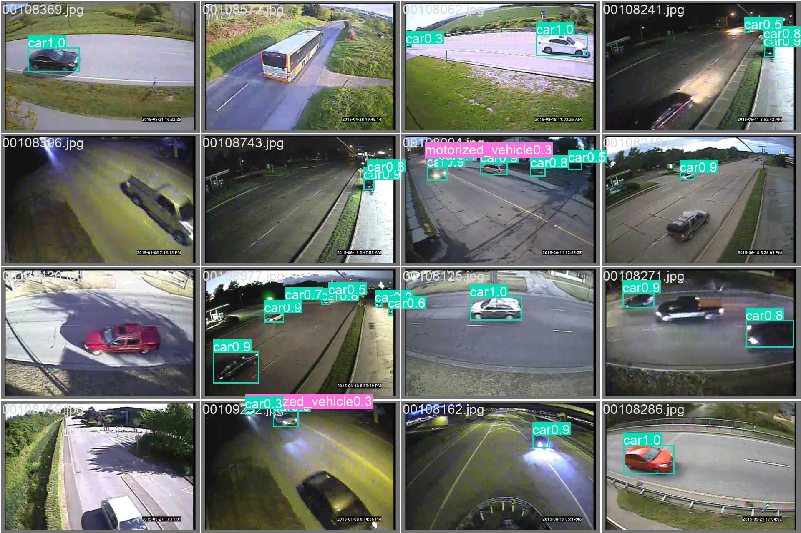

# TrafficYOLO Hardware and Deployment Workflow

This directory contains the YOLO26n profiling, robustness,
structured-compression, NCNN-export, and PYNQ-Z2 workflow. Its numbered
layout is retained to keep the associated scripts and evidence traceable.

## Guides

- [1. Model training](1_tarin.md)
- [2. Profiling](2_profiling.md)
- [3. Error injection](3_error_injection.md)
- [4. Limited Global L1 pruning](4_custom_global_L1.md)
- [5. Layer-replacement pruning](5_layer_replacement.md)
- [6. PyTorch-to-NCNN export](6_pt_to_ncnn.md)
- [7. Size, speed, and accuracy](7_size_speed_accuracy.md)
- [8. PC-to-PYNQ live video](8_pc_pynq_video.md)

## Layout

| Path | Contents |
|---|---|
| `1_data/` | Dataset descriptors and split metadata |
| `2_scripts/` | Training, profiling, pruning, export, and evaluation scripts |
| `2_scripts_pynq/` | C++ NCNN runner/server and board shell scripts |
| `3_models/` | Archived checkpoints and NCNN exports used by this workflow |
| `4_results_profi/`--`8_results_pt/` | Profiling, robustness, compression, NCNN, and checkpoint evidence |
| `figures/` | Selected qualitative validation prediction grids |

Refer to the individual guides for experimental scope and interpretation.

## Selected validation visual evidence

These recorded visual examples also appear in the
[Validate section of the model-training guide](1_tarin.md#validate). They are
qualitative evidence only; use the recorded metric tables and reports for
quantitative comparisons.

### Per-class precision--recall behaviour

### Training and validation metric history

### Qualitative structured-pruning predictions

