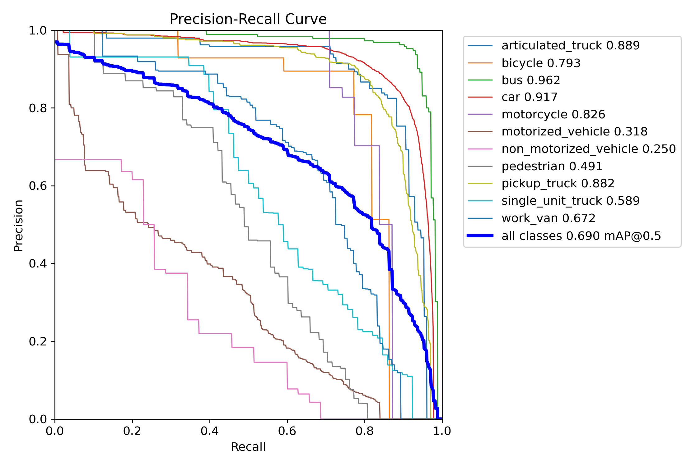
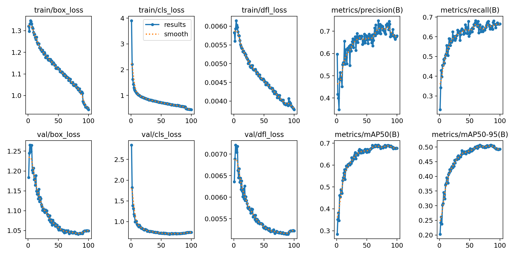

# TrafficYOLO Hardware and Deployment Workflow

This directory contains the YOLO26n profiling, robustness,
structured-compression, NCNN-export, and PYNQ-Z2 workflow. Its numbered
layout is retained to keep the associated scripts and evidence traceable.

## Guides

- [1. Model training](1_tarin.md)
- [2. Profiling](2_profiling.md)
- [3. Error injection](3_error_injection.md)
- [4. Limited Global L1 pruning](4_custom_global_L1.md)
- [5. Layer-replacement pruning](5_layer_replacement.md)
- [6. PyTorch-to-NCNN export](6_pt_to_ncnn.md)
- [7. Size, speed, and accuracy](7_size_speed_accuracy.md)
- [8. PC-to-PYNQ live video](8_pc_pynq_video.md)

## Layout

| Path | Contents |
|---|---|
| `1_data/` | Dataset descriptors and split metadata |
| `2_scripts/` | Training, profiling, pruning, export, and evaluation scripts |
| `2_scripts_pynq/` | C++ NCNN runner/server and board shell scripts |
| `3_models/` | Archived checkpoints and NCNN exports used by this workflow |
| `4_results_profi/`--`8_results_pt/` | Profiling, robustness, compression, NCNN, and checkpoint evidence |
| `figures/` | Selected qualitative validation prediction grids |

Refer to the individual guides for experimental scope and interpretation.

## Selected validation visual evidence

These recorded visual examples also appear in the
[Validate section of the model-training guide](1_tarin.md#validate). They are
qualitative evidence only; use the recorded metric tables and reports for
quantitative comparisons.

### Per-class precision--recall behaviour

### Training and validation metric history

### Qualitative structured-pruning predictions

## Appendix

### PYNQ-Z2 Benchmark Configuration
| Setting | Value |
|---|---:|
| Batch size | 1 |
| NCNN CPU threads | 2 |
| Warm-up inferences | 5 |
| Measured repetitions | 3 |
| Benchmark images | 50 |
| Confidence threshold | 0.25 |
| NMS IoU threshold | 0.70 |
| Maximum detections | 300 |

### Full-Checkpoint Validation Results
| Domain | mAP50 | mAP50:95 |
|---|---:|---:|
| GEN | 0.8300 | 0.6414 |
| SNOW (early NGEN) | 0.3241 | 0.1899 |

### Moderate-Pruning Results with 20-Epoch Recovery
| Method | Domain | Parameter Reduction | Raw mAP50:95 | Recovered mAP50:95 | Retention | Recovery Epochs |
|---|---|---:|---:|---:|---:|---:|
| Global L1 | GEN | 10.2552% | 0.00000 | 0.61650 | 96.12% | 20 |
| Global L1 | SNOW | 10.2376% | 0.00000 | 0.10316 | 54.32% | 20 |
| Layer replacement C007 (L9, L19) | GEN | 10.3601% | 0.05904 | 0.61843 | 96.42% | 20 |
| Layer replacement C007 (L9, L19) | SNOW | 10.3649% | 0.07606 | 0.18068 | 95.14% | 20 |
| Layer replacement L9 control | GEN | 6.5631% | 0.54008 | 0.63470 | 98.95% | 20 |
| Layer replacement L9 control | SNOW | 6.5661% | 0.15584 | 0.19081 | 100.47% | 20 |

### Exploratory Comparison of Two Sensitivity Indicators
| Layer | Type | Mean GEN Noise Drop, ρ = 1.0–2.0 | GEN Removal Drop |
|---:|---|---:|---:|
| 0 | Conv | 0.467164 | 0.499741 |
| 1 | Conv | 0.379612 | 0.499715 |
| 3 | Conv | 0.341082 | 0.499739 |
| 9 | SPPF | 0.119105 | 0.064609 |
| 17 | Conv | 0.020264 | 0.319833 |
| 20 | Conv | 0.004854 | 0.148795 |
| 22 | C3k2 | 0.112209 | 0.158090 |

### Representative GEN NCNN Accuracy, Storage, and PYNQ-Z2 Runtime Results
| Model | Pruning | Input | Precision | Size (MiB) | mAP50:95 | Median (ms) | FPS |
|---|---:|---:|---|---:|---:|---:|---:|
| Baseline Full | 0% | 640 | FP32 | 9.189 | 0.6417 | 10,586.52 | 0.0947 |
| Baseline Full | 0% | 480 | FP32 | 9.147 | 0.6289 | 5,615.44 | 0.1760 |
| Baseline Full | 0% | 320 | FP32 | 9.117 | 0.5736 | 2,463.94 | 0.3976 |
| Baseline Full | 0% | 640 | FP16 | 4.671 | 0.6421 | 10,302.23 | 0.0974 |
| Baseline Full | 0% | 640 | INT8 | 2.442 | 0.4425 | 7,743.30 | 0.1293 |
| Global L1 p10 | 10.25% | 640 | FP32 | 8.210 | 0.6179 | 7,860.91 | 0.1280 |
| Layer replacement p10 | 10.36% | 640 | FP32 | 8.198 | 0.6227 | 9,591.50 | 0.1044 |
| Global L1 p56 | 56.50% | 640 | FP32 | 3.793 | 0.3846 | 3,749.41 | 0.2623 |
| Layer replacement p56 | 56.50% | 640 | FP32 | 3.986 | 0.5796 | 8,280.81 | 0.1212 |
| Global L1 p56 | 56.50% | 320 | INT8 | 1.004 | 0.0338 | 833.85 | 1.1685 |
| Layer replacement p56 | 56.50% | 320 | INT8 | 1.043 | 0.2977 | 1,522.98 | 0.6425 |

### Software-Side Profiling Summary
| Measurement | Latency | Share / Result |
|---|---:|---|
| Detect top-level layer | 1.724 ms | 31.13% of layer sum |
| All C3k2 layers | 2.649 ms | 47.83% of layer sum |
| Summed top-level layers | 5.539 ms | Diagnostic only |
| Preprocessing | 0.243 ms/image | — |
| Inference | 1.004 ms/image | 77.71% of SW total |
| Post-processing | 0.044 ms/image | — |
| End-to-end validation timing | 1.292 ms/image | 774.17 FPS |

### Baseline PYNQ-Z2 Processing-Time Breakdown
| Stage | Mean Time (ms) |
|---|---:|
| Image I/O | 22.83 |
| Preprocessing | 73.82 |
| NCNN inference | 10,485.54 |
| Post-processing | 1.86 |
| Compute total | 10,561.21 |
| Total including I/O | 10,584.04 |

### Complete NCNN Deployment-Size Results
| Model | Pruned | Input | Precision | `.param` (B) | `.bin` (B) | Total (MiB) |
|---|---:|---:|---|---:|---:|---:|
| `0_baseline_official` | 0% | 640 | FP32 | 26,404 | 9,736,936 | 9.311 |
| `1_baseline_light` | 0% | 640 | FP32 | 26,400 | 9,609,132 | 9.189 |
| `2_baseline_full` | 0% | 640 | FP32 | 26,400 | 9,609,132 | 9.189 |
| `2_baseline_full_480` | 0% | 480 | FP32 | 26,398 | 9,565,032 | 9.147 |
| `2_baseline_full_320` | 0% | 320 | FP32 | 26,398 | 9,533,532 | 9.117 |
| `2_baseline_full_fp16` | 0% | 640 | FP16 | 26,400 | 4,872,012 | 4.671 |
| `2_baseline_full_int8` | 0% | 640 | INT8 | 23,518 | 2,537,544 | 2.442 |
| `2_baseline_full_320_int8` | 0% | 320 | INT8 | 23,516 | 2,461,944 | 2.370 |
| `3_global_L1_p10` | 10.25% | 640 | FP32 | 26,382 | 8,582,536 | 8.210 |
| `3_global_L1_p10_320` | 10.25% | 320 | FP32 | 26,380 | 8,506,936 | 8.138 |
| `3_global_L1_p10_320_int8` | 10.25% | 320 | INT8 | 23,498 | 2,201,368 | 2.122 |
| `3_global_L1_p56` | 56.50% | 640 | FP32 | 26,292 | 3,951,328 | 3.793 |
| `3_global_L1_p56_320` | 56.50% | 320 | FP32 | 26,290 | 3,875,728 | 3.721 |
| `3_global_L1_p56_320_int8` | 56.50% | 320 | INT8 | 23,408 | 1,029,096 | 1.004 |
| `3_global_L1_snow_p10` | 10.25% | 640 | FP32 | 26,381 | 8,583,112 | 8.211 |
| `4_layer_replacement_p10` | 10.36% | 640 | FP32 | 23,340 | 8,573,312 | 8.198 |
| `4_layer_replacement_p10_320` | 10.36% | 320 | FP32 | 23,338 | 8,497,712 | 8.126 |
| `4_layer_replacement_p10_320_fp16` | 10.36% | 320 | FP16 | 23,338 | 4,276,688 | 4.101 |
| `4_layer_replacement_p10_320_int8` | 10.36% | 320 | INT8 | 20,845 | 2,196,640 | 2.115 |
| `4_layer_replacement_p56` | 56.50% | 640 | FP32 | 20,529 | 4,159,572 | 3.986 |
| `4_layer_replacement_p56_320` | 56.50% | 320 | FP32 | 20,527 | 3,930,372 | 3.768 |
| `4_layer_replacement_p56_320_int8` | 56.50% | 320 | INT8 | 18,325 | 1,075,656 | 1.043 |
| `4_layer_replacement_snow_p10` | 10.36% | 640 | FP32 | 23,334 | 8,570,972 | 8.196 |

### Complete PYNQ-Z2 NCNN Runtime Results
| Model | Median (ms) | P95 (ms) | Compute FPS | Peak RSS (MiB) | CPU (%) |
|---|---:|---:|---:|---:|---:|
| `0_baseline_official` | 11,042.63 | 11,105.18 | 0.0908 | 142.82 | 94.92 |
| `1_baseline_light` | 10,592.06 | 10,670.68 | 0.0946 | 133.03 | 95.28 |
| `2_baseline_full` | 10,586.52 | 10,649.80 | 0.0947 | 132.96 | 95.27 |
| `2_baseline_full_480` | 5,615.44 | 5,845.74 | 0.1760 | 101.40 | 96.85 |
| `2_baseline_full_320` | 2,463.94 | 2,718.53 | 0.3976 | 73.49 | 97.18 |
| `2_baseline_full_fp16` | 10,302.23 | 10,368.86 | 0.0974 | 132.97 | 97.41 |
| `2_baseline_full_int8` | 7,743.30 | 7,822.83 | 0.1293 | 98.77 | 96.41 |
| `2_baseline_full_320_int8` | 1,829.84 | 2,095.79 | 0.5345 | 54.04 | 96.71 |
| `3_global_L1_p10` | 7,860.91 | 7,932.47 | 0.1280 | 106.14 | 96.04 |
| `3_global_L1_p10_320` | 1,855.39 | 2,117.79 | 0.5272 | 64.98 | 95.83 |
| `3_global_L1_p10_320_int8` | 1,449.47 | 1,695.41 | 0.6758 | 51.57 | 96.50 |
| `3_global_L1_p56` | 3,749.41 | 4,020.61 | 0.2623 | 93.35 | 95.29 |
| `3_global_L1_p56_320` | 871.95 | 1,078.79 | 1.1205 | 51.71 | 95.49 |
| `3_global_L1_p56_320_int8` | 833.85 | 1,030.36 | 1.1685 | 47.24 | 95.04 |
| `3_global_L1_snow_p10` | 8,402.61 | 8,458.44 | 0.1199 | 116.19 | 96.01 |
| `4_layer_replacement_p10` | 9,591.50 | 9,645.31 | 0.1044 | 158.14 | 96.62 |
| `4_layer_replacement_p10_320` | 2,284.64 | 2,549.35 | 0.4287 | 77.83 | 97.10 |
| `4_layer_replacement_p10_320_fp16` | 2,284.45 | 2,541.89 | 0.4248 | 78.05 | 96.33 |
| `4_layer_replacement_p10_320_int8` | 1,697.91 | 1,946.81 | 0.5764 | 57.62 | 96.61 |
| `4_layer_replacement_p56` | 8,280.81 | 8,413.30 | 0.1212 | 127.17 | 94.74 |
| `4_layer_replacement_p56_320` | 1,939.34 | 2,238.09 | 0.5005 | 69.03 | 95.77 |
| `4_layer_replacement_p56_320_int8` | 1,522.98 | 1,780.54 | 0.6425 | 57.30 | 96.47 |
| `4_layer_replacement_snow_p10` | 9,586.83 | 9,668.62 | 0.1046 | 158.66 | 96.73 |

### Complete Server-Side NCNN Accuracy Results
| Model | mAP50 | mAP50:95 | Car AP50:95 | Pedestrian AP50:95 |
|---|---:|---:|---:|---:|
| `1_baseline_light` | 0.7302 | 0.5503 | 0.6911 | 0.3262 |
| `2_baseline_full` | 0.8307 | 0.6417 | 0.7200 | 0.3836 |
| `2_baseline_full_480` | 0.8188 | 0.6289 | 0.7086 | 0.3470 |
| `2_baseline_full_320` | 0.7700 | 0.5736 | 0.6604 | 0.2449 |
| `2_baseline_full_fp16` | 0.8308 | 0.6421 | 0.7200 | 0.3839 |
| `2_baseline_full_int8` | 0.6344 | 0.4425 | 0.6118 | 0.2577 |
| `2_baseline_full_320_int8` | 0.5499 | 0.3702 | 0.5359 | 0.1612 |
| `3_global_L1_p10` | 0.8111 | 0.6179 | 0.7109 | 0.3487 |
| `3_global_L1_p10_320` | 0.7322 | 0.5289 | 0.6285 | 0.1768 |
| `3_global_L1_p10_320_int8` | 0.4418 | 0.2817 | 0.4412 | 0.0685 |
| `3_global_L1_p56` | 0.5527 | 0.3846 | 0.6223 | 0.0213 |
| `3_global_L1_p56_320` | 0.4186 | 0.2855 | 0.4658 | 0.0060 |
| `3_global_L1_p56_320_int8` | 0.0619 | 0.0338 | 0.1465 | 0.0008 |
| `3_global_L1_snow_p10` | 0.2176 | 0.1186 | 0.2836 | 0.0511 |
| `4_layer_replacement_p10` | 0.8193 | 0.6227 | 0.7188 | 0.3680 |
| `4_layer_replacement_p10_320` | 0.7628 | 0.5637 | 0.6548 | 0.2360 |
| `4_layer_replacement_p10_320_fp16` | 0.7630 | 0.5639 | 0.6549 | 0.2359 |
| `4_layer_replacement_p10_320_int8` | 0.5207 | 0.3393 | 0.5169 | 0.1436 |
| `4_layer_replacement_p56` | 0.7784 | 0.5796 | 0.7127 | 0.3338 |
| `4_layer_replacement_p56_320` | 0.7189 | 0.5272 | 0.6459 | 0.2018 |
| `4_layer_replacement_p56_320_int8` | 0.4453 | 0.2977 | 0.5063 | 0.1242 |
| `4_layer_replacement_snow_p10` | 0.3493 | 0.2008 | 0.4215 | 0.1962 |
